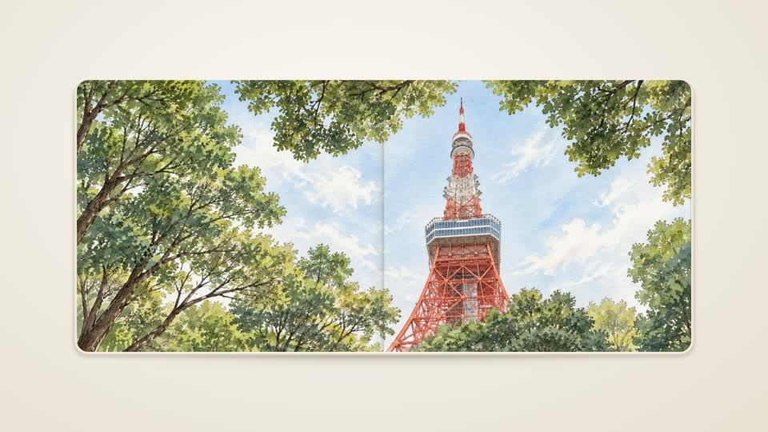
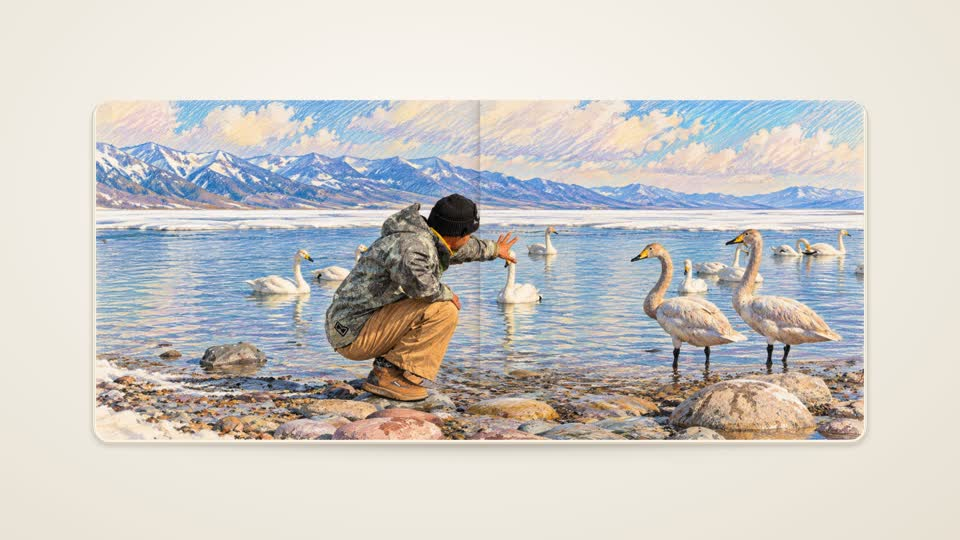
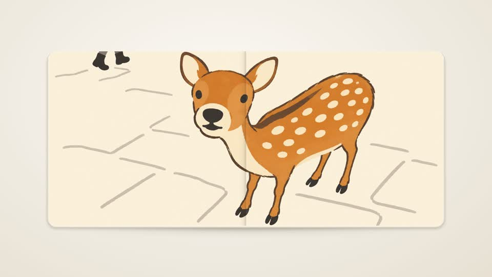
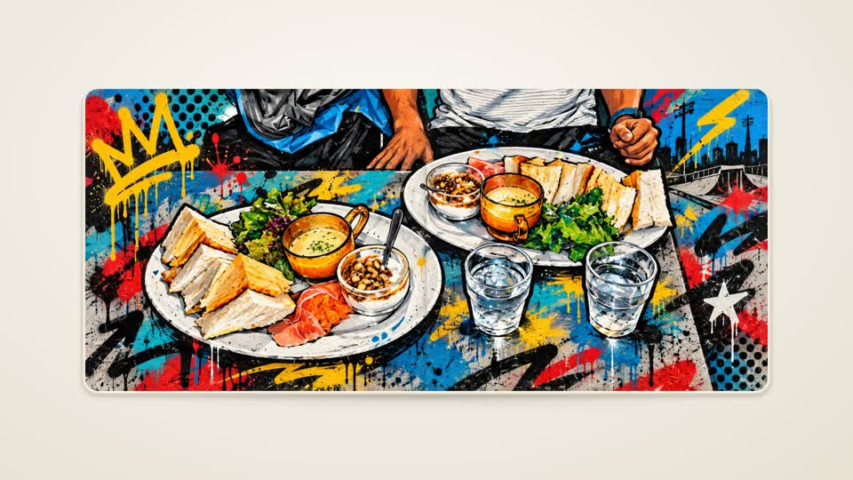
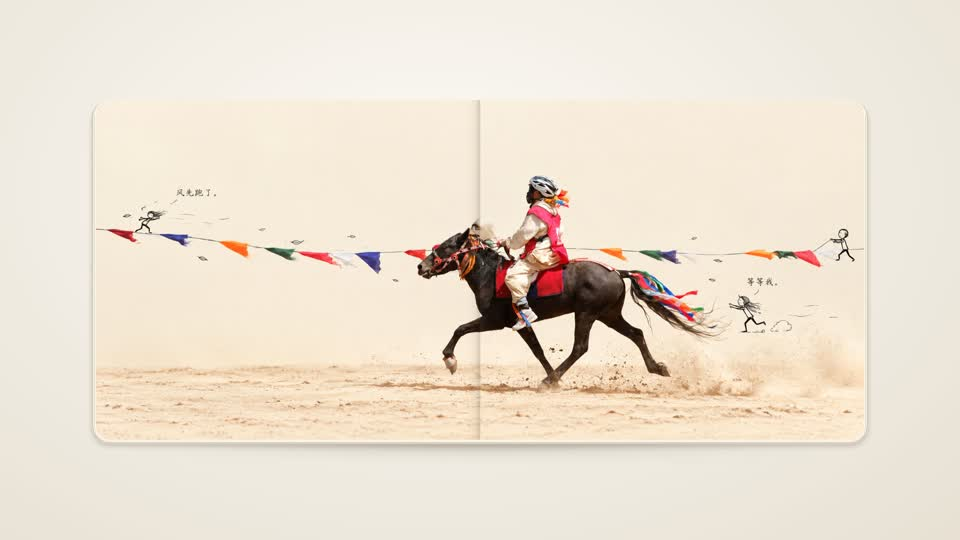
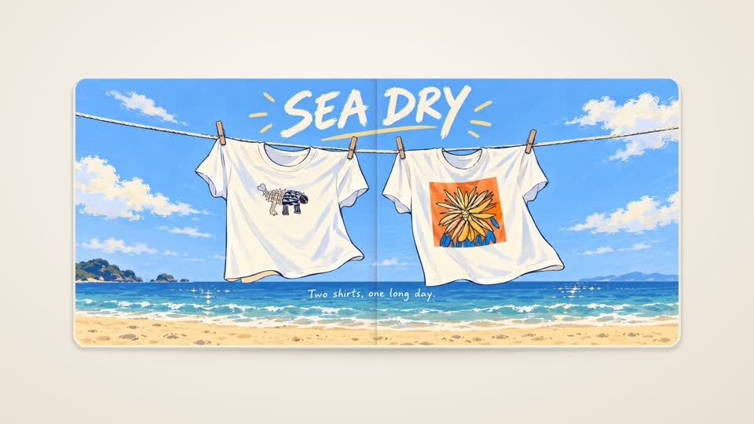

# Photos to Album

English | [简体中文](README_CN.md)

**Your photos. A book you can play.**

A Codex skill that turns a photo collection into a page-turning MP4 and matching book-style images. Keep your original photos, or give people and scenery a new artistic treatment.

https://github.com/user-attachments/assets/9d328705-48eb-41b8-80d5-7d35b3325622

**[Download the full 4K demo](https://github.com/109km/photos-to-album/raw/refs/heads/main/assets/demo-4k.mp4)** · 10 photos · 33 seconds · 60 fps · 2-second holds

*Made with the travel-album style. Press play above to watch the full demo in 1080p (8.55 MB). Download the full travel-photo MP4 (50 MB) to watch it in your video player; the direct link bypasses GitHub’s large-file preview. For a small, reproducible sample using synthetic landscapes, run `npm run demo`—no photos or image-generation account needed.*

[Quick start](#quick-start) · [Examples](#try-it) · [Settings](#settings) · [Troubleshooting](references/troubleshooting.md) · [Contributing](CONTRIBUTING.md)

## What you get

- An **MP4**, silent by default with optional page-flip sound, with curved page turns, paper edges and shadows.
- Matching **book-style PNGs**, with a 3840-pixel long edge.
- Your photos in the order you supplied, with original files untouched.
- A choice of **original photos** or **AI-styled photos**.

**Landscape and portrait photos are welcome.** In AI-styled mode, the skill automatically expands the scenery around photos to fill the resolved album ratio: **2.26:1** for landscape/square videos, or **1:2.26** for portrait videos such as 9:16. Landscape photos in a portrait album are expanded above and below before the video is rendered. It fills the pages without stretching the photo or adding blank bands, while keeping subjects recognizable. Set `image_ratio` to use a different shape. In `photo_style: origin`, photos are fitted proportionally with ivory margins instead of AI expansion; source files remain untouched.

This is a skill for an agent, with a local renderer. It is not a hosted service or a one-command AI image generator.

## Quick start

### 1. Install the skill

Install from [109km/photos-to-album](https://github.com/109km/photos-to-album). This repository contains the standalone skill, not the separate web app.

**Recommended: ask Codex to install and verify**

```text
Install the photos-to-album skill from https://github.com/109km/photos-to-album
into my Codex skills directory. Use the repository ZIP if Git is unavailable.
Run npm run setup and verify the result.
Do not overwrite an existing installation. Report local rendering readiness
and whether AI styling is available or still unverified.
```

**Install with the Skills CLI**

With Node.js/npm and Git available, run:

```sh
npx skills add 109km/photos-to-album
```

Choose Codex and your preferred installation scope if prompted. The CLI installs the skill files; it does **not** run this skill's rendering setup. In the installed folder, run `npm run setup`, or tell Codex: **“Run setup for the installed photos-to-album skill and verify rendering.”** Use the ZIP method below if you do not have Git.

**Manual installation on macOS** requires [Node.js 22 or newer](https://nodejs.org/en/download) with npm. **Git is optional**: it is used only for cloning and Git-based updates, not rendering.

**Without Git — download the ZIP:**

1. [Download the skill ZIP](https://github.com/109km/photos-to-album/archive/refs/heads/main.zip) and extract it.
2. Rename the extracted `photos-to-album-main` folder to `photos-to-album`.
3. Move it into `~/.codex/skills/` (create that folder if needed). If you configured `CODEX_HOME`, use its `skills/` folder instead. The result should be `~/.codex/skills/photos-to-album/SKILL.md`, without an extra nested folder. Keep an existing installation rather than overwriting it.
4. Open a terminal in the installed `photos-to-album` folder and run `npm run setup`, or ask Codex to run setup there.

**With Git — clone and set up:**

```sh
album_skill_dir="${CODEX_HOME:-$HOME/.codex}/skills/photos-to-album"
if [ -e "$album_skill_dir" ]; then
  echo "Already installed: $album_skill_dir. See Keep it working below."
else
  git clone https://github.com/109km/photos-to-album.git "$album_skill_dir" &&
  (cd "$album_skill_dir" && npm run setup)
fi
```

This uses your configured `CODEX_HOME`, or `~/.codex` by default. Existing files are not overwritten. Windows/Linux installation is not yet verified.

### 2. Confirm setup succeeded

**Using this at a company?** Remotion is free for individuals, nonprofits and for-profit organizations with up to 3 employees. Larger for-profit organizations need a paid Company License. See [licensing details](#license-and-release-status) before rendering.

**Skip running setup again if installation already reported success.** The Codex and manual instructions include setup; after a Skills CLI install, run it once as described above. If you only copied the skill folder, open a terminal there and run:

```sh
npm run setup
```

Setup installs the pinned packages, downloads the rendering browser if needed, and checks a real test video and two book images. It does not use your photos or install global packages.

Wait for **“Ready: local image preparation and MP4 rendering work.”** A failed check means setup is not complete. [Get help](references/troubleshooting.md).

Prefer to use Codex? Ask: **“Set up the photos-to-album skill and run its setup check.”** Installing the folder alone does not execute setup.

Before a batch, ask Codex for two separate results. **Setup success verifies local rendering only.** These are agent checks, not two statuses automatically produced by the setup script.

| Readiness check | What Codex should report |
|---|---|
| Original-photo rendering | Whether the setup/check MP4 and still export passed |
| AI styling | Whether an image-editing tool is available in this session; distinguish available from tested |


Use `ready`, `unavailable`, or `not yet verified`, with the evidence for each. For `origin`, mark the unused checks `not needed`. If a required capability is unavailable, explain it before generation; do not silently switch modes.

### 3. Attach photos and make an album

In Codex, attach your photos and send:

```text
$photos-to-album photo_style: origin, duration: 2s
```

Start with `origin`: it needs no image-generation tool. To try the renderer before using photos, run `npm run demo` from the skill folder.

## Which photos should I use?

Start with **3–5 JPEG/JPG or PNG photos**. This is a recommended first batch, not a hard limit. Larger batches take longer, especially with AI styling and 4K rendering.

- **JPEG/JPG and PNG:** recommended input formats. Use full-resolution originals where possible.
- **iPhone HEIC/HEIF:** export copies as JPEG or PNG first. Direct support depends on the image tools and installed decoders; it is not guaranteed by setup.
- **Camera RAW** (such as RAF, CR2/CR3, NEF, ARW or DNG): develop/export to JPEG or PNG in your photo editor first. This skill does not provide a RAW development workflow.
- Other formats are not part of the beginner compatibility promise. Ask Codex to check a sample before a batch. A file accepted as a chat attachment is not necessarily usable by the image editor or renderer.

## Where are my finished files?

Tell Codex where to save the album, for example:

```text
Save this album in ~/Downloads/my-travel-album/ and give me links to the video and book images when finished.
```

Without a location, Codex should choose a new job folder under `outputs/` in the current workspace and tell you its full path before starting. This is the agent workflow convention; the renderer itself requires an explicit MP4 path.

For an output named `album.mp4`, the result looks like:

```text
my-travel-album/
  album.mp4
  album.mp4.stills/
    01-book.png
    02-book.png
  album.mp4.json
```

Prepared artwork and the source-to-output mapping also stay in the job folder. The JSON metadata contains local source paths: keep it private when sharing the video. Existing output names are not overwritten; choose a new name for another version.

## Choose the photo order

For a predictable sequence, name copies `01-beach.jpg`, `02-mountain.jpg`, `03-cafe.jpg`, then say **“Use these photos in filename order.”** Original files do not need to be renamed.

- An explicit list such as `cafe.jpg → beach.jpg → mountain.jpg` takes priority.
- Attachments otherwise keep their supplied order. If that order is unclear, Codex should show the filename sequence before starting.
- For a folder, the default is filename order with numbers sorted naturally (`2` before `10`), using image files directly inside it. Subfolders are included only if requested. This is an agent selection rule; the renderer keeps the exact order in its `images` list.

## Review the images before making a video

Attach your photos and paste this first-use prompt:

```text
Use $photos-to-album with these attached photos in filename order.

Check original-photo rendering and AI-styling readiness first.
Apply ink-and-watercolor styling to people and scenery, keeping subjects recognizable.
Show me the book-style images first and wait for approval before making the video.
After approval, make a 1080p, 16:9 video with 3-second holds.
```

Codex should deliver the book-style images and stop at your requested review stage. After you say **“Approved—make the video,”** it should reuse those approved images' artwork. The 1080p and 3-second settings above are deliberate overrides; the defaults remain **4K and 2 seconds**. Without a review request, the workflow proceeds to video.

## Try it

### Six built-in styles and demo videos

Click a preview to watch the full 720p MP4 demo. All six artwork styles share the book and page-turn renderer. The base default remains `travel-album`; `origin` preserves source photos.

#### Watercolor · `watercolor`

[](https://github.com/109km/photos-to-album/blob/main/assets/style-demos/watercolor.mp4)

[Watch demo](https://github.com/109km/photos-to-album/blob/main/assets/style-demos/watercolor.mp4) · [Download MP4](https://github.com/109km/photos-to-album/raw/refs/heads/main/assets/style-demos/watercolor.mp4) · [Style guide](references/watercolor.md)

#### Colorful pencil · `pencil`

[](https://github.com/109km/photos-to-album/blob/main/assets/style-demos/pencil.mp4)

[Watch demo](https://github.com/109km/photos-to-album/blob/main/assets/style-demos/pencil.mp4) · [Download MP4](https://github.com/109km/photos-to-album/raw/refs/heads/main/assets/style-demos/pencil.mp4) · [Style guide](references/pencil.md)

#### Illustration · `illustration`

[](https://github.com/109km/photos-to-album/blob/main/assets/style-demos/illustration.mp4)

[Watch demo](https://github.com/109km/photos-to-album/blob/main/assets/style-demos/illustration.mp4) · [Download MP4](https://github.com/109km/photos-to-album/raw/refs/heads/main/assets/style-demos/illustration.mp4) · [Style guide](references/illustration.md)

#### Street graffiti · `graffiti`

[](https://github.com/109km/photos-to-album/blob/main/assets/style-demos/graffiti.mp4)

[Watch demo](https://github.com/109km/photos-to-album/blob/main/assets/style-demos/graffiti.mp4) · [Download MP4](https://github.com/109km/photos-to-album/raw/refs/heads/main/assets/style-demos/graffiti.mp4) · [Style guide](references/graffiti.md)

#### Hand-drawing story · `hand-drawing-story`

[](https://github.com/109km/photos-to-album/blob/main/assets/style-demos/hand-drawing-story.mp4)

[Watch demo](https://github.com/109km/photos-to-album/blob/main/assets/style-demos/hand-drawing-story.mp4) · [Download MP4](https://github.com/109km/photos-to-album/raw/refs/heads/main/assets/style-demos/hand-drawing-story.mp4) · [Style guide](references/hand-drawing-story.md)

#### Postcard drawing · `postcard-drawing`

[](https://github.com/109km/photos-to-album/blob/main/assets/style-demos/postcard-drawing.mp4)

[Watch demo](https://github.com/109km/photos-to-album/blob/main/assets/style-demos/postcard-drawing.mp4) · [Download MP4](https://github.com/109km/photos-to-album/raw/refs/heads/main/assets/style-demos/postcard-drawing.mp4) · [Style guide](references/postcard-drawing.md)

```text
$photos-to-album photo_style: postcard-drawing, quality: 4k
```

**Keep the photos as they are**

```text
$photos-to-album photo_style: origin, duration: 2s
```

**Watercolor people and scenery**

```text
$photos-to-album photo_style: watercolor, quality: 4k
```

**Street-art photo album**

```text
$photos-to-album photo_style: graffiti, duration: 2s
```

**AI photography treatment (regenerates the scene)**

This generates a new interpretation of people and scenery in a photographic style; it is not a conventional exposure, sharpness or color enhancement of the original photo. Person masks and source-person compositing are not required. Choose `origin` to keep the original photo content.

```text
$photos-to-album photo_style: master award photography, duration: 2s
```

**A vertical video**

```text
$photos-to-album photo_style: origin, video_ratio: 9:16
```

This `origin` example keeps the complete photos and may show ivory margins. For AI-expanded vertical scenery, use:

```text
$photos-to-album photo_style: watercolor, video_ratio: 9:16
```

Both vertical examples create a vertical album with a horizontal center fold and bottom-to-top page turns. You do not need to set `image_ratio` separately.

## Video shape versus album shape


- `video_ratio` sets the video canvas and turn direction: portrait videos turn bottom to top; landscape/square videos turn right to left.
- With `image_ratio` omitted, the open album is **1:2.26** in portrait videos and **2.26:1** otherwise. An explicit `image_ratio` overrides the album shape, while turn direction still follows the video orientation.
- **One upright photo spans the whole two-page spread**: top/bottom pages in portrait video, left/right pages otherwise. The photo is not rotated sideways.
- Resolve the video orientation before preparing artwork. Switching an existing wide album to portrait requires preparing new canvases at the new ratio; the renderer does not stretch or rotate old artwork to fit.

The diagram shows resting layouts; the page-turn animation can extend beyond the book's resting bounds.

## Settings

| Setting | Default | Examples |
|---|---|---|
| `photo_style` | `travel-album` | `origin`, `travel-album`, `watercolor`, `pencil`, `illustration`, `graffiti`, `hand-drawing-story`, `postcard-drawing`, or your own description |
| `duration` | `2s` per photo | `2s`, `4s`, `1.5s` |
| `quality` | `4k` | `720p`, `1080p`, `4k` |
| `video_ratio` | `16:9` | `9:16`, `1:1` |
| `image_ratio` | `1:2.26` for portrait video; `2.26:1` otherwise | Explicit ratio overrides the automatic album shape |

Duration is the still-photo hold. Each page turn adds 1 second; opening and closing add 2 seconds each. **Ten photos at `2s` produce a 33-second video.**

Chinese parameter names and values are also supported. For example:

```text
$photos-to-album 照片风格：原图，停留时间：2秒，视频画质：超高清
```

See the [Chinese parameter table](README_CN.md#参数说明). English and Chinese can be mixed; conflicting aliases are rejected.

## Choose your photo treatment

| | `origin` | AI-styled photos |
|---|---|---|
| Photo content | Original composition and colors | People and scenery are restyled; scenery is extended |
| People | No retouching or regeneration | Stylized in the selected medium |
| Different photo shapes | Fit proportionally with ivory margins | Extend scenery to fill the album |
| Image-generation tool | Not needed | Required in the Codex session |

Both modes add book geometry and lighting during presentation. `origin` resizes photos to fit, so exported pixels are not byte-identical to the original files. Read [how origin works](references/origin.md).

For AI styles, people may be stylized along with scenery. No person masks, pixel locking or source-person compositing are required. The agent checks recognizable subjects, anatomy, poses, clothing and accessories against the originals before rendering.

## Before you start

- **Setup covers local rendering.** It cannot unlock image generation in your account. A built-in image tool needs no separate API key; provider limits or charges may apply.
- **4K is an output size.** Generated artwork may be upscaled. A larger video does not recover missing photographic detail.
- **Photos stay local in origin preparation and rendering.** AI styling sends reference images to the selected image provider. Attaching photos to Codex is also subject to that service's data handling; this is not an offline-only workflow.
- **macOS is tested.** Windows and Linux are not yet verified. Some Linux systems need browser libraries. Large albums and 4K exports take more time and memory.
- **The turn may extend outside the frame briefly.** This is a known, accepted animation limitation.

## Keep it working

After updating the skill, run `npm run setup` again. Run `npm run check` to verify an existing installation without reinstalling packages; it may download a missing browser.

[Render prepared images](references/render.md) · [Troubleshoot setup](references/troubleshooting.md) · [Add a style](CONTRIBUTING.md) · [Agent instructions](SKILL.md)

## License and release status

This skill's original code and documentation are licensed under the [MIT License](LICENSE). You may use, modify, and redistribute them, including commercially, while retaining the copyright and license notice. See the [release checklist](RELEASING.md) for remaining release tasks.

The MIT license covers our original code and documentation, not Remotion or other third-party dependencies. Setup installs Remotion separately; its own license still applies to each user or organization.

For the pinned Remotion version **4.0.518**:

| User or organization | Remotion license |
|---|---|
| Individual, including commercial work | Free |
| For-profit organization with up to 3 employees | Free |
| Nonprofit or not-for-profit organization | Free |
| For-profit organization with 4 or more employees | Paid Company License required |

The employee count applies to the organization, not just the people using this skill. Noncommercial evaluation is also eligible for the free license. Check the [official Remotion license](https://github.com/remotion-dev/remotion/blob/main/LICENSE.md) and [Company License options](https://www.remotion.pro/license), especially before upgrading Remotion. This project's MIT license does not grant rights to relicense Remotion itself.

The featured 4K demo was made from travel photos approved for this project's public demo. The separate `npm run demo` sample uses synthetic landscapes. The code's MIT license does not establish reuse rights for photo-based media; use your own photos or obtain the appropriate permission.

See [third-party and demo notices](THIRD_PARTY_NOTICES.md).

[Report an issue](https://github.com/109km/photos-to-album/issues)

## Optional page-flip sound

Page-flip sound is **off by default**. Enable a soft paper rustle at each page turn:

```text
$photos-to-album photo_style: postcard-drawing, page_flip_sound: true
```

Use `page_flip_sound: false` for silent output. In job JSON, use `"pageFlipSound": true` (the snake_case alias also works). A CC0 recording of a real page turn is bundled; no download or audio service is required during rendering. See [sound credits](assets/page-flip-source.md). Still images and single-page albums have no flip sound.
