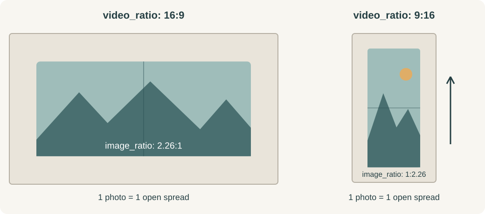

# Photos to Album · 照片翻页相册

**把你的照片，变成一本会翻页的相册。**

这是一个 Codex 技能：将多张照片制作成翻页 MP4 视频，并导出配套的书本样式图片。你可以保留原图，也可以让 AI 为风景换一种画风。

[English](README.md) | 简体中文

https://github.com/user-attachments/assets/9d328705-48eb-41b8-80d5-7d35b3325622

**[下载完整 4K 演示](https://github.com/109km/photos-to-album/raw/refs/heads/main/assets/demo-4k.mp4)** · 10 张照片 · 33 秒 · 60 帧/秒 · 每张停留 2 秒

*使用 travel-album 样式制作。点击上方播放按钮，即可观看完整 1080p 演示（8.55 MB）。下载完整旅行照片 MP4（50 MB）后，使用视频播放器观看；下载链接可绕过 GitHub 的大文件预览限制。另可运行 `npm run demo` 生成小型矢量山景示例，无需照片或图片生成服务。*

[快速开始](#快速开始) · [使用示例](#使用示例) · [参数说明](#参数说明) · [故障排查](#遇到问题怎么办) · [参与贡献](CONTRIBUTING.md)

## 你会得到什么

- 一个无声 **MP4 视频**，包含弯曲翻页、纸张边缘和阴影。
- 一组配套的**书本样式 PNG 图片**，长边为 3840 像素。
- 照片按你提供的顺序排列，原始文件不会被覆盖。
- 可选择**保留原图**或 **AI 风景风格化**。

**横版和竖版照片都可以直接使用。** 在 AI 风格化模式下，技能会自动扩展照片周围的风景，填满所需相册比例：横屏或正方形视频默认为 **2.26:1**，9:16 等竖屏视频默认为 **1:2.26**。横版照片用于竖向相册时，会先向上、向下扩展风景，再生成视频。画面铺满书页，不拉伸照片、不添加空白条，并保留人物。你也可以通过 `相册比例`（`image_ratio`）指定其他比例。使用“原图”（`photo_style: origin`）模式时，不进行 AI 扩图，而是等比放入相册，空余区域使用象牙白；原始文件始终保持不变。

这是“智能体工作流程 + 本地渲染器”，不是在线网站，也不是单独执行一条命令就能生成 AI 图片的服务。

## 快速开始

### 1. 安装技能

从 [109km/photos-to-album](https://github.com/109km/photos-to-album) 安装。本仓库只包含独立技能，不包含网页应用。

**推荐：让 Codex 安装并验证**

```text
请从 https://github.com/109km/photos-to-album 安装 photos-to-album
到我的 Codex 技能目录。运行 npm run setup 并验证结果，不要覆盖已有安装。
分别说明本地渲染是否就绪，以及 AI 风格化和人物保留能力是否可用或尚未验证。
```

**macOS 手动安装**需要 Git，以及包含 npm 的 [Node.js 22 或更新版本](https://nodejs.org/en/download)：

```sh
album_skill_dir="${CODEX_HOME:-$HOME/.codex}/skills/photos-to-album"
if [ -e "$album_skill_dir" ]; then
  echo "Already installed: $album_skill_dir. See the update instructions below."
else
  git clone https://github.com/109km/photos-to-album.git "$album_skill_dir" &&
  (cd "$album_skill_dir" && npm run setup)
fi
```

命令使用配置的 `CODEX_HOME`，默认是 `~/.codex`。已有文件不会被覆盖；Windows/Linux 安装尚未验证。

### 2. 确认初始化成功

**在公司使用？** Remotion 对个人、非营利组织以及员工不超过 3 人的营利组织免费。员工更多的营利组织需要付费 Company License。渲染前请阅读[许可说明](#许可证与发布状态)。

**如果安装已报告成功，无需再次运行初始化。** 上述安装步骤已经运行初始化。若你只是复制了技能文件夹，请在该文件夹中打开终端，执行：

```sh
npm run setup
```

它会安装锁定版本的依赖、按需下载渲染浏览器，并实际生成一段测试视频和两张书本图片。测试不使用你的照片，也不安装全局 npm 包。

看到以下提示才表示本地渲染环境通过验证：

```text
Ready: local image preparation and MP4 rendering work.
```

也可以直接告诉 Codex：**“帮我初始化 photos-to-album 技能，并运行安装检查。”** 仅复制或安装技能文件夹，并不会自动执行初始化脚本。

批量制作前，让 Codex 分别报告以下三项。**初始化成功仅代表本地渲染通过检查。** 这些是智能体需要做的检查，并不是初始化脚本自动输出的三个状态。

| 就绪检查 | Codex 应说明什么 |
|---|---|
| 原图渲染 | 初始化/安装检查中的 MP4 和书本图片导出是否通过 |
| AI 风格化 | 当前会话是否有图片编辑工具；区分“可用”和“已测试” |
| 人物保留 | 是否有保护蒙版及原始人物合成能力；先验证第一张，再处理其余照片 |

每项使用“就绪”“不可用”或“尚未验证”，并说明依据。原图模式或没有人物时，不用的检查标为“不需要”。缺少必要能力时应在生成前说明，不能悄悄改变人物或切换模式。

### 3. 上传照片，开始制作

在 Codex 中附上照片，然后发送：

```text
$photos-to-album 照片风格：原图，停留时间：2秒
```

建议第一次先使用“原图”：不需要图片生成工具。想先体验效果而不使用自己的照片，可以在技能目录执行 `npm run demo`。

## 可以使用哪些照片？

第一次建议使用 **3–5 张 JPEG/JPG 或 PNG 照片**。这是入门建议，不是数量上限；更多照片会耗时更久，尤其是 AI 风格化和 4K 渲染。

- **JPEG/JPG、PNG：** 推荐格式，尽量使用完整分辨率的原图。
- **iPhone HEIC/HEIF：** 请先导出 JPEG 或 PNG 副本。能否直接读取取决于图片工具和已安装的解码器，初始化成功不代表支持这些格式。
- **相机 RAW**（如 RAF、CR2/CR3、NEF、ARW、DNG）：请先在照片编辑软件中处理并导出 JPEG 或 PNG。本技能不提供 RAW 显影流程。
- 其他格式不属于入门兼容性承诺，请先让 Codex 检查一张样本。聊天能接收附件，不代表图片编辑器或渲染器一定能处理。

## 成品保存在哪里？

可以直接指定保存位置：

```text
请把这次相册保存到 ~/Downloads/my-travel-album/，完成后给我视频和书本图片的链接。
```

未指定位置时，Codex 应在当前工作区的 `outputs/` 下新建任务文件夹，并在开始前告诉你完整路径。这是智能体的工作流约定；渲染脚本本身需要明确的 MP4 输出路径。

以 `album.mp4` 为例，成品结构如下：

```text
my-travel-album/
  album.mp4
  album.mp4.stills/
    01-book.png
    02-book.png
  album.mp4.json
```

准备好的图片和原图对应关系也保留在任务文件夹中。JSON 元数据包含本地原图路径，分享视频时请勿一并公开。已有输出不会被覆盖；制作另一版时使用新名称。

## 如何确定照片顺序

最容易控制的方式是将照片副本命名为 `01-海边.jpg`、`02-山景.jpg`、`03-咖啡馆.jpg`，并告诉 Codex：**“按文件名顺序制作。”** 无需重命名原始文件。

- 明确列出的顺序优先，例如 `咖啡馆.jpg → 海边.jpg → 山景.jpg`。
- 附件默认保留提供顺序；如果无法确定，Codex 应在开始前展示文件名序列。
- 文件夹默认按文件名自然排序，数字 `2` 在 `10` 前，只选择该文件夹直接包含的图片。仅在你要求时包含子文件夹。这是智能体选图规则；渲染器严格使用 `images` 列表中的顺序。

## 先看图片，再制作视频

附上照片，然后发送这个入门提示词：

```text
使用 $photos-to-album，按文件名顺序处理这些附件照片。

先检查原图渲染、AI 风格化、人物保留能力是否就绪。
保留每个人的真实摄影形象，不改变人物。
只将风景处理成细墨线与透明水彩风格。
先给我看书本样式图片，等我批准后再制作视频。
批准后制作 1080p、16:9 视频，每张停留 3 秒。
```

Codex 应先交付书本样式图片，并停在你要求的审核阶段。你回复 **“批准，制作视频”** 后，再复用已批准图片的画面。这里的 1080p 和 3 秒是特意指定的参数；默认仍是 **4K、2 秒**。没有提出审核要求时，工作流会继续制作视频。

## 使用示例

**保留原图**

```text
$photos-to-album 照片风格：原图，停留时间：2秒
```

**水彩风景，保留真实人物**

```text
$photos-to-album 照片风格：水彩，视频画质：超高清
```

**AI 摄影处理（重新生成风景）**

这种模式会以摄影风格生成新的非人物风景，并非对原图进行常规曝光、锐度或色彩增强。人物仍需通过保护蒙版和原图合成保留。想保留原照片内容，请选择“原图”。

```text
$photos-to-album 照片风格：大师级摄影，停留时间：2秒
```

**竖屏视频**

```text
$photos-to-album 照片风格：原图，视频比例：9：16
```

上述“原图”示例保留完整照片，比例不同时会有象牙白留白。需要 AI 扩图铺满竖向相册时，使用：

```text
$photos-to-album 照片风格：水彩，视频比例：9：16
```

两个竖屏示例都会自动使用竖向相册、水平中缝和从下往上的翻页动画，无需另外设置相册比例。中英文参数可以混合使用。

## 视频比例与相册比例有什么区别



- `视频比例`（`video_ratio`）决定视频画布和翻页方向：竖屏从下往上翻，横屏或正方形从右往左翻。
- 不指定 `相册比例`（`image_ratio`）时，竖屏相册默认为 **1:2.26**，其他视频默认为 **2.26:1**。明确指定相册比例时，以你的设置为准；翻页方向仍由视频方向决定。
- **一张保持正向的照片铺满整个跨页**：竖屏为上下两页，其他视频为左右两页。不会将照片横着旋转。
- 先确定视频方向，再准备图片。将已有横向相册改成竖向时，需要按新比例重新准备图片；渲染器不会直接拉伸或旋转旧图片。

示意图展示静止布局；翻页时，页面可能超出相册静止时的边界。

## 参数说明

| 中文参数 | 英文参数 | 默认值 | 可用值或示例 |
|---|---|---|---|
| `照片风格`（也可用 `图片风格`） | `photo_style` | 细墨线与透明水彩风景 | `原图`、`水彩`、`大师级摄影`，或自定义中文描述 |
| `停留时间`（也可用 `每张时长`） | `duration` | `2秒` | `2秒`、`4秒`、`1.5秒`；使用正数 |
| `视频画质`（也可用 `画质`） | `quality` | `4k` | `高清`＝720p，`全高清`＝1080p，`超高清`＝4k；也可直接写 720p、1080p、4K |
| `视频比例` | `video_ratio` | `16:9` | `9:16`、`1:1`、`16：9`、`16比9` |
| `相册比例`（也可用 `图片比例`） | `image_ratio` | 竖屏 `1:2.26`；其他 `2.26:1` | 明确设置时覆盖自动相册比例 |

“原图”“原始照片”“不改照片”都对应 `origin`。其他风格描述由智能体理解，不是固定的滤镜列表。

停留时间仅计算静止展示。每次翻页另加 1 秒，开头和结尾各加 2 秒。**10 张照片，每张停留 2 秒，视频总长为 33 秒。**

如果同一个参数同时写了中英文名称，请保持含义一致。例如 `duration: 2s` 和 `停留时间: 3秒` 相互冲突，不能静默选择其中一个。

## 两种照片处理方式

| | 原图模式 | AI 风景风格化 |
|---|---|---|
| 照片内容 | 保留原始构图和颜色 | 对风景进行风格化，并扩展画面 |
| 人物 | 不修饰、不重新生成 | 通过检查过的蒙版放回原始人物 |
| 比例不一致 | 等比放入相册，空余区域使用象牙白 | 扩展风景以填满相册 |
| 图片生成工具 | 不需要 | 当前 Codex 会话中必须可用 |

两种模式都会在展示时加入书本边缘、中缝和阴影。原图模式仍会按展示尺寸等比缩放，因此导出像素并非与源文件逐字节一致。书页边缘保留少量安全留白，防止圆角裁掉照片内容。

AI 模式不能只靠提示词保证人物不变。头发、手部、衣服和配饰都需要检查蒙版。小人物的自动蒙版可能漏掉肢体：智能体必须放大检查人物局部，修补遗漏，并在渲染前对照原图检查整个人物。仅验证蒙版内像素一致，不能证明蒙版完整覆盖了人物。如果缺少可靠的工具，智能体应明确说明限制，不能悄悄改变人物或切换模式。

## 使用前了解这些限制

- **初始化负责本地渲染，不负责开通 AI 服务。** 内置图片工具可用时无需另填 API Key，但仍受服务额度和费用规则约束。
- **4K 表示输出尺寸，不保证原生细节。** 生成的风景可能经过放大；提高视频分辨率不会凭空恢复原照片细节。
- **原图处理和渲染在本地进行。** AI 风格化会将参考图片发送给选定的图片服务。将照片附到 Codex 中也适用该服务的数据处理规则；这不是完全离线的工作流。
- **目前在 macOS 上验证过。** Windows 和 Linux 尚未完成验证；部分 Linux 环境需要额外的浏览器系统库。4K 和大量照片会消耗更多时间、内存和磁盘空间。
- **翻页时可能短暂超出画面边缘。** 这是目前已接受的动画限制。

## 更新和检查

更新技能文件后，运行：

```sh
npm run setup
```

只想检查现有安装、不重新安装依赖时，运行：

```sh
npm run check
```

检查时仍可能下载缺失的浏览器。测试会真实渲染，并在结束后清理临时测试文件。

## 遇到问题怎么办

| 问题 | 处理方式 |
|---|---|
| 找不到 node 或 npm | 安装 Node.js，重新打开终端后重试。 |
| 找不到 package.json | 请在技能文件夹中执行命令。 |
| 依赖缺失或版本不一致 | 重新运行 `npm run setup`，不要自行混用 Remotion 版本。 |
| 浏览器下载失败 | 检查网络和代理后重试；首次下载约 100 MB。 |
| Linux 缺少浏览器库 | 按 [Remotion 官方说明](https://www.remotion.dev/docs/miscellaneous/linux-dependencies)安装对应系统库；初始化脚本不会执行 sudo。 |
| 无图片生成工具 | 可使用原图模式；其他风格需要当前会话支持。 |
| 原图周围有留白 | 比例不一致时属于正常行为，避免裁切或扩图。 |
| 输出文件已存在 | 换一个输出文件名，之前的视频、图片目录和元数据会受到保护。 |
| 渲染内存不足 | 先试 720p 或减少照片数量。 |

提交问题时，请附上系统、Node.js 版本、命令、参数和错误信息。分享日志前移除私人路径和密钥，优先使用演示素材复现问题。完整说明见[故障排查（英文）](references/troubleshooting.md)。

## 开发者入口

[渲染器文档（英文）](references/render.md) · [贡献指南（英文）](CONTRIBUTING.md) · [智能体指令](SKILL.md)

用户提示词和渲染器 JSON 使用的字段有区别。渲染器也支持中文 JSON 字段，如“图片”“视频比例”“停留时间”；但其中的图片必须已准备好。它不会因为写了“照片风格”就自动生成图片。见渲染器文档中的映射表。

## 许可证与发布状态

本技能的原创代码和文档采用 [MIT 许可证](LICENSE)。你可以使用、修改和分发，包括商业用途，但须保留版权声明和许可证声明。其他发布事项请参阅[发布检查清单（英文）](RELEASING.md)。

MIT 许可证仅覆盖本项目的原创代码和文档，不覆盖 Remotion 或其他第三方依赖。初始化时会单独安装 Remotion，每位用户或组织仍须遵守其许可条款。

当前固定使用的 Remotion **4.0.518** 适用以下要求：

| 使用者或组织 | Remotion 许可要求 |
|---|---|
| 个人，包括商业用途 | 免费 |
| 员工不超过 3 人的营利组织 | 免费 |
| 非营利组织 | 免费 |
| 员工达到 4 人及以上的营利组织 | 需要付费 Company License |

员工人数按整个组织计算，不只是使用本技能的人数。尚未用于商业用途的评估也可适用免费许可。请查看 [Remotion 官方许可证](https://github.com/remotion-dev/remotion/blob/main/LICENSE.md)和[公司许可方案](https://www.remotion.pro/license)，升级 Remotion 前尤其需要重新确认。本项目的 MIT 许可证不授予重新许可 Remotion 本身的权利。

主推的 4K 演示使用了已获准用于本项目公开演示的旅行照片；单独运行 `npm run demo` 生成的示例使用程序绘制的山景。代码的 MIT 许可证不代表照片类媒体的复用授权；请使用自己的照片或取得相应许可。

另请参阅[第三方依赖与演示素材说明（英文）](THIRD_PARTY_NOTICES.md)。

[反馈问题](https://github.com/109km/photos-to-album/issues)
